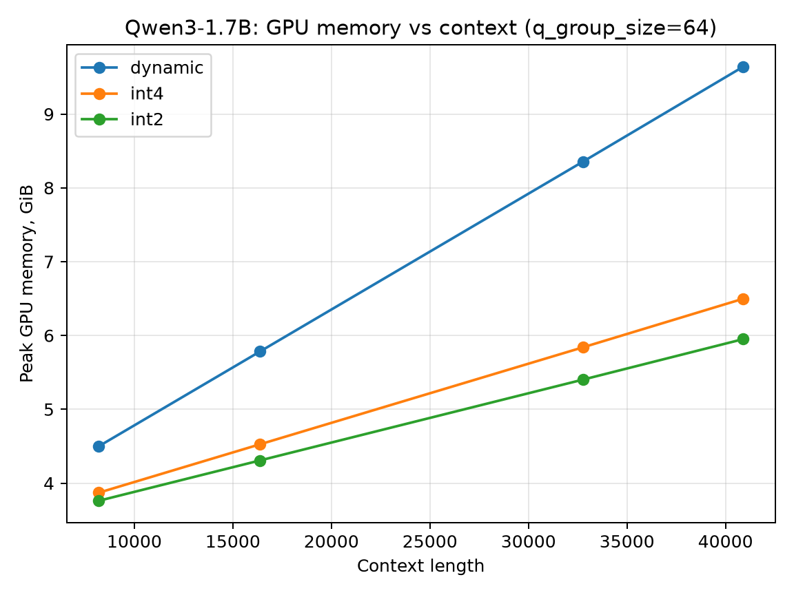
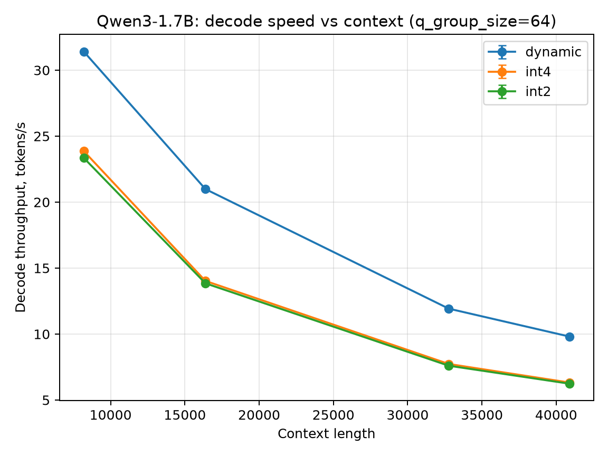
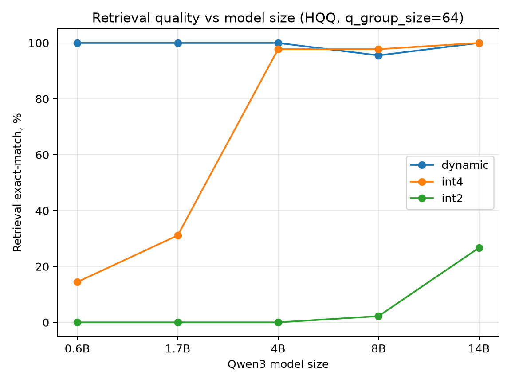
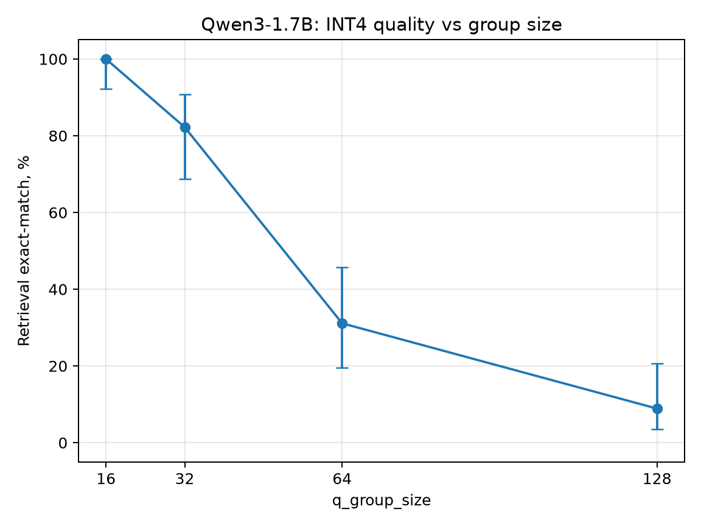
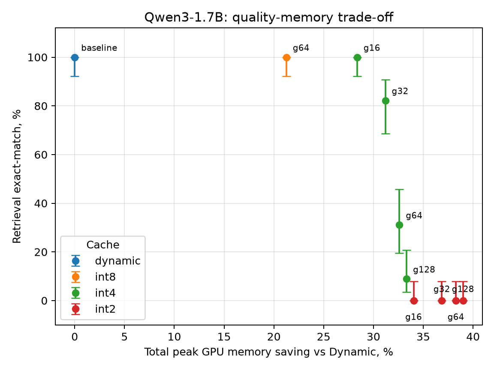

# Квантизация KV Cache в малых языковых моделях: качество, память и скорость

Экспериментальное исследование `HQQ QuantizedCache` из Hugging Face Transformers на моделях Qwen3. Цель работы — не предложить новый алгоритм квантизации, а измерить, какой практический компромисс между качеством, GPU-памятью и скоростью даёт доступная из коробки реализация KV-cache quantization.

Основные performance-эксперименты выполнены на NVIDIA Tesla V100-SXM2 32 GB на кластере НИУ ВШЭ.

## Главные результаты

- На Qwen3-1.7B при контексте 40895 токенов `INT4 g64` уменьшил физический KV Cache с `4.368` до `1.229 GiB` (`3.56x`) и total peak GPU memory с `9.640` до `6.497 GiB` (`-32.6%`), но decode throughput снизился с `9.891 ± 0.004` до `6.344 ± 0.006 tok/s`.
- Одна и та же `INT4 g64` конфигурация сильно по-разному влияла на модели Qwen3: exact retrieval составил `14.4%` для 0.6B, `31.1%` для 1.7B и `97.8–100%` для 4B–14B.
- Самый сильный эффект обнаружен в ablation по `q_group_size` на Qwen3-1.7B: при INT4 переход `g16 -> g64` увеличил экономию total peak GPU memory только с `28.4%` до `32.6%`, но exact retrieval снизился с `45/45` до `14/45`.
- Short-context control на Qwen3-0.6B показал, что деградация `INT4 g64` возникает уже на 2K–4K токенов и не объясняется только экстремально длинным контекстом.

## Исследовательские вопросы

**RQ1.** Насколько HQQ-квантизация KV Cache уменьшает реальное потребление GPU-памяти и как влияет на скорость инференса?

**RQ2.** Как устойчивость к одной и той же конфигурации квантизации меняется с размером модели Qwen3?

**RQ3.** Насколько `q_group_size` влияет на компромисс между качеством и экономией памяти?

**RQ4.** Является ли деградация качества малых моделей исключительно следствием длинного контекста?

## Что исследуется и как это связано с литературой

В основной части используется `QuantizedCache` из Transformers 5.17.0 с HQQ backend:

```text
backend = hqq
axis_key = 1
axis_value = 1
residual_length = 128
```

Для сравнения моделей используется `q_group_size=64`; на Qwen3-1.7B дополнительно проверяются `g16`, `g32`, `g64`, `g128`.

Для HQQ backend [документация Transformers](https://huggingface.co/docs/transformers/kv_cache) рекомендует `axis_key=1` и `axis_value=1`; эта конфигурация и используется в работе.

Работа **не является воспроизведением [KIVI](https://arxiv.org/abs/2402.02750)**. KIVI мотивирует разные схемы квантизации для Keys и Values из-за различий их распределений, тогда как здесь исследуется stock HQQ QuantizedCache. Наблюдения KIVI полезны как мотивация дальнейших ablation, но текущие эксперименты не устанавливают механизм зависимости качества от `q_group_size`.

Основной результат работы — эмпирическая характеристика stock HQQ QuantizedCache на Qwen3: отдельно измеряются физический размер KV Cache, total GPU memory, latency, устойчивость моделей разного размера и чувствительность к `q_group_size`.

Подробнее: [`notes/literature.md`](notes/literature.md).

## Экспериментальная постановка

### Модели и оборудование

Используются Qwen3-0.6B, 1.7B, 4B, 8B и 14B.

- Performance для 0.6B–8B: одна NVIDIA Tesla V100-SXM2 32 GB.
- Qwen3-14B: только quality experiment на двух V100; её latency не сравнивается с 1-GPU результатами.
- Python 3.11, PyTorch 2.14.0, CUDA 12.6, Transformers 5.17.0, HQQ 0.2.8.post1.

### Сравниваемые cache

- `DynamicCache` — baseline без квантизации KV Cache;
- HQQ INT8;
- HQQ INT4;
- HQQ INT2.

### Performance

Измеряются:

- prefill time;
- decode throughput, tokens/s;
- end-to-end time;
- `torch.cuda.max_memory_allocated()` после сброса peak statistics;
- физический размер resident KV Cache по реальным tensor storages.

Финальный Qwen3-1.7B ablation имеет `3` повтора на каждую пару context/configuration; в model-scaling performance для 0.6B используется `5` повторов, для 1.7B–8B — `3`. В итоговых таблицах сохраняются mean и sample standard deviation.

Attention implementation явно не фиксируется; используется реализация, автоматически выбранная текущим Transformers/PyTorch stack.

### Quality benchmark

Используется контролируемая synthetic retrieval-задача. В детерминированный filler помещается случайный уникальный восьмизначный passkey на позиции около `10%`, `50%` или `90%` контекста. После контекста модель получает прямой вопрос и должна вернуть восемь цифр.

Prompts формируются как raw text/raw token sequence: `apply_chat_template` не используется, отдельный Qwen3 thinking mode не включается.

Контексты основного quality experiment: `8192`, `16384`, `32768`. Для short-context control: `2048`, `4096`.

Метрики:

- `normalized exact-match` — основная;
- teacher-forced top-1 для decode tokens;
- teacher-forced NLL.

Размер выборки: 0.6B — `n=90`; 1.7B/4B/8B/14B — `n=45`; group-size ablation — `n=45` на конфигурацию; short-context control — `n=30` на cache/context.

Для exact-match в финальном анализе рассчитаны 95% интервалы Уилсона; на quality-графиках они показаны как error bars.

Подробнее: [`notes/methodology_details.md`](notes/methodology_details.md).

## Результаты

### 1. Sanity check: размер DynamicCache совпадает с теорией

Для Qwen3-0.6B измеренный физический размер DynamicCache линейно растёт с длиной контекста и совпадает с расчётом из числа слоёв, KV-heads, `head_dim` и FP16 storage:

| Context | Dynamic KV Cache |
|---:|---:|
| 8192 | 0.875 GiB |
| 16384 | 1.750 GiB |
| 24576 | 2.625 GiB |
| 32768 | 3.500 GiB |
| 40895 | 4.368 GiB |

Это используется как проверка корректности memory measurement pipeline.

### 2. Квантизация экономит память, но в протестированном code path замедляет decode

Canonical Qwen3-1.7B результаты при 40895 токенах:

| Cache | KV Cache, GiB | KV compression | Peak GPU, GiB | Peak saving | Decode, tok/s |
|---|---:|---:|---:|---:|---:|
| Dynamic | 4.368 | 1.00x | 9.640 | 0.0% | 9.891 ± 0.004 |
| INT8 g64 | 2.321 | 1.88x | 7.591 | 21.3% | 6.764 ± 0.009 |
| INT4 g64 | 1.229 | 3.56x | 6.497 | 32.6% | 6.344 ± 0.006 |
| INT2 g64 | 0.683 | 6.40x | 5.950 | 38.3% | 6.261 ± 0.001 |

Физический KV Cache сжимается значительно сильнее, чем вся GPU memory, потому что веса модели и другие allocations не квантуются вместе с cache.

Простая оценка storage хорошо совпадает с измерениями. Если на группу из `g` значений приходится `b` бит на значение и два FP16 параметра `scale` и `zero`, то:

```text
effective bits/value ~= b + 32/g
compression ~= 16 / (b + 32/g)
```

Отсюда:

```text
INT4 g16 -> 2.67x
INT4 g64 -> 3.56x
INT2 g64 -> 6.40x
```

В Transformers 5.17.0 протестированный `QuantizedLayer` перед attention деквантует уже квантованные K/V. Это согласуется с наблюдаемым slowdown: меньший storage не означает меньшую вычислительную стоимость decode.





### 3. Устойчивость к одной INT4-конфигурации зависит от размера модели

Для всех моделей используется `INT4/INT2 g64`.

| Qwen3 | n | Dynamic exact | INT4 exact | INT4 top-1 | INT2 exact | INT2 top-1 |
|---|---:|---:|---:|---:|---:|---:|
| 0.6B | 90 | 90/90 = 100% | 13/90 = 14.4% | 72.6% | 0/90 = 0% | 2.1% |
| 1.7B | 45 | 45/45 = 100% | 14/45 = 31.1% | 86.4% | 0/45 = 0% | 4.4% |
| 4B | 45 | 45/45 = 100% | 44/45 = 97.8% | 99.7% | 0/45 = 0% | 28.9% |
| 8B | 45 | 43/45 = 95.6% | 44/45 = 97.8% | 100% | 1/45 = 2.2% | 58.1% |
| 14B | 45 | 45/45 = 100% | 45/45 = 100% | 100% | 12/45 = 26.7% | 78.6% |



На этой задаче более крупные протестированные Qwen3 значительно устойчивее к `INT4 g64`. Это не является универсальным scaling law и не доказывает порог около 4B параметров.

Для 8B разница Dynamic `95.6%` против INT4 `97.8%` не интерпретируется как улучшение: Wilson intervals сильно перекрываются (`85.2–98.8%` и `88.4–99.6%`).

Teacher-forced top-1 часто остаётся значительно выше exact-match. Например, для 1.7B INT4 exact составляет `31.1%`, а decode top-1 — `86.4%`; для 14B INT2 — `26.7%` и `78.6%`. Это показывает, что провал полного восьмизначного ответа может происходить при сохранении высокой доли правильных target tokens.

### 4. `q_group_size` — главный quality/memory trade-off

Qwen3-1.7B, INT4, `n=45` на конфигурацию:

| q_group_size | Exact retrieval | 95% Wilson CI | TF top-1 | KV compression | Peak saving | Decode, tok/s |
|---:|---:|---:|---:|---:|---:|---:|
| 16 | 45/45 = 100% | 92.1–100% | 100% | 2.67x | 28.4% | 6.335 ± 0.008 |
| 32 | 37/45 = 82.2% | 68.7–90.7% | 96.9% | 3.20x | 31.2% | 6.343 ± 0.004 |
| 64 | 14/45 = 31.1% | 19.5–45.7% | 86.4% | 3.56x | 32.6% | 6.344 ± 0.006 |
| 128 | 4/45 = 8.9% | 3.5–20.7% | 68.6% | 3.76x | 33.3% | 6.354 ± 0.003 |



Переход `g16 -> g64` даёт только около `4.25` процентного пункта дополнительной экономии total peak GPU memory (`28.4% -> 32.6%`), но observed exact retrieval падает с `45/45` до `14/45`. При этом decode throughput почти не меняется.

Для INT2 уменьшение группы не восстановило exact retrieval на 1.7B: для `g16/g32/g64/g128` получено `0/45`.



### 5. Short-context control: деградация есть уже на 2K–4K

Qwen3-0.6B:

| Cache | 2048 tokens | 4096 tokens |
|---|---:|---:|
| Dynamic | 30/30 = 100% | 30/30 = 100% |
| INT4 g64 | 2/30 = 6.7% | 0/30 = 0% |
| INT2 g64 | 0/30 = 0% | 0/30 = 0% |

Следовательно, слабый результат `INT4 g64` на 0.6B нельзя объяснить только очень длинным KV Cache: сильная деградация присутствует уже на 2K–4K.

## Дополнительные эксперименты

### StaticCache и `torch.compile`

На Qwen3-0.6B обычный StaticCache не дал заметной экономии peak memory и был медленнее DynamicCache. `StaticCache + torch.compile` после дорогого cold compilation был быстрее Dynamic на коротких контекстах, но преимущество исчезало между 8K и 12K. Это вторичный результат и не относится напрямую к HQQ quality trade-off.

### Offloaded Cache

Обычные Dynamic/Static cache прошли correctness checks. Для Offloaded Cache наблюдалась зависимая от timing/synchronization деградация на длинных последовательностях; с `CUDA_LAUNCH_BLOCKING=1` проблема исчезала в протестированном диапазоне. Поэтому performance Offloaded Cache не включён в основные выводы.

### INT3

HQQ 0.2.8.post1 создавал INT3 quantized tensors, но используемый dequantization path падал на shape/size mismatch. Этот результат трактуется только как ограничение протестированного HQQ/Transformers path, а не как утверждение о невозможности INT3 в HQQ вообще.

## Ограничения

- Проверено только семейство Qwen3; выводы о model-size robustness нельзя автоматически переносить на другие архитектуры.
- Quality оценивается на одной контролируемой synthetic retrieval-задаче, а не на широком LongBench/RULER наборе.
- Основные результаты относятся к HQQ QuantizedCache в Transformers 5.17.0 с `axis_key=1`, `axis_value=1`; они не описывают все алгоритмы KV-cache quantization.
- Performance измерен на V100, batch size 1. Другие GPU и специализированные kernels могут дать другой latency profile.
- Qwen3-14B проверялась только по качеству на двух V100.
- `attn_implementation` явно не фиксировалась в benchmark.
- Wilson intervals здесь описывают binomial uncertainty внутри benchmark trials; они не доказывают перенос результата на другие задачи и модели.

## Выводы

1. HQQ QuantizedCache действительно сильно уменьшает физический KV Cache, но эта степень сжатия не переносится один-в-один на total GPU memory.
2. В протестированном Transformers/HQQ path на V100 INT4/INT2 уменьшают память ценой заметного slowdown decode.
3. Устойчивость к одинаковой INT4-конфигурации сильно различается между размерами Qwen3.
4. `q_group_size` может быть не менее важен, чем сам bit-width: на Qwen3-1.7B `INT4 g16` и `INT4 g64` имеют близкую decode speed и сравнительно небольшую разницу в total memory saving, но радикально различаются по retrieval quality.
5. Практическую KV-cache quantization нельзя оценивать только по bit-width или коэффициенту compression: одновременно нужны quality, total memory и latency.

## Воспроизводимость

Финальный анализ:

```bash
python src/analyze_final.py
```

Агрегированные таблицы:

```text
results/summary/final/
```

Основные canonical файлы:

```text
memory_latency_tradeoff.csv
qwen17_final_context_performance.csv
model_scaling_quality.csv
group_size_quality.csv
group_size_performance.csv
short_context_control.csv
```

Финальные графики:

```text
plots/final/
```

Сырые результаты:

```text
results/raw/
```

Slurm-конфигурации:

```text
slurm/
```

Фиксированные версии окружения:

```text
requirements.lock.txt
```

## Структура репозитория

```text
.
├── notes/                  # literature и технические детали методики
├── plots/final/            # финальные графики
├── results/
│   ├── raw/                # сырые CSV
│   └── summary/final/      # canonical агрегированные таблицы
├── slurm/                  # воспроизводимые GPU jobs
├── src/                    # benchmark и analysis scripts
├── requirements.lock.txt
└── README.md
```
